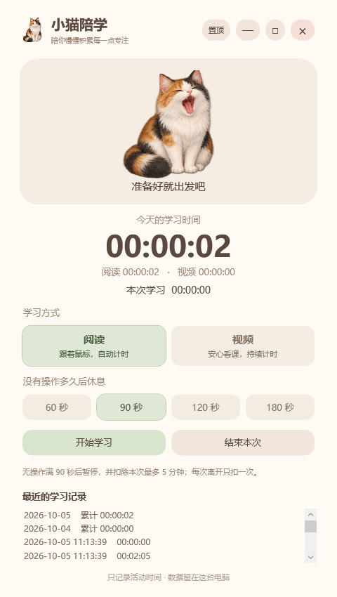
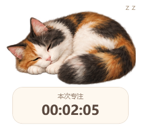

# 小猫陪学

自用 Windows 学习时间统计软件，带一只毛茸茸的三花猫“小花”。





## 启动

关闭正在运行的旧版本后，双击「StudyCat-Calico.exe」或「启动小猫陪学.cmd」。这是已经编译好的独立桌面程序，使用 Windows 自带的 .NET Framework 和 WPF，不需要安装 Python、Node 或第三方库，也不需要通过隐藏的 PowerShell 窗口启动。三花猫素材已嵌入程序，单独复制这个可执行文件也能运行；原有 data 目录继续使用。

程序已经打开时，再次双击会恢复已有窗口；最小化的窗口也会恢复。学习方式和暂停时间直接用圆角按钮点选，浅绿色表示当前选项。应用文件与任务栏使用小猫图标，顶部使用奶油色标题栏；按住标题区域可拖动，双击可最大化或还原，右侧保留置顶、最小化、最大化和关闭按钮。

## 计时规则

- 点击「开始学习」，才开始记录；软件不会默默统计所有电脑使用时间。
- 开始后，屏幕上出现独立置顶的小猫，下方显示本次专注时间。按住小猫或时间牌可自由拖动，松开后记住位置；主界面最小化时小猫继续显示。
- 双击悬浮小猫打开主界面；右键可暂停、继续或结束本次学习，还可以“摸摸小花”。专注时小猫蜷睡、呼吸、偶尔梦中伸爪，约每 45～90 秒经过翻肚皮姿态后换边睡；暂停或离开时醒来打哈欠、伸懒腰，随后随机眨眼、歪头、舔爪或趴在书边。结束本次或关闭程序后收起小猫。
- 阅读模式检测当前 Windows 登录会话里的鼠标、滚轮、点击和键盘活动；无操作达到阈值后自动暂停，恢复操作后自动继续。
- 默认阈值 90 秒，可选 60 / 90 / 120 / 180 秒。阅读模式达到阈值时，扣除本次已累计时间中的 5 分钟，不足 5 分钟则扣到 0；一次连续无操作只扣一次，恢复操作后才会开始下一次判断。
- 扣时同步更新本次时长、每天的阅读／视频统计及结束后的单次记录，按最近累计的时间倒序扣除，不影响之前结束的学习。跨午夜的学习也按实际所属日期扣除。视频模式、手动暂停和锁屏／关屏本身不会触发扣时。
- 视频模式持续计时，忽略输入超时；去玩手机时要手动暂停。
- 两种模式都在 Windows 报告关屏、锁屏时自动暂停；亮屏、解锁后仍按当前模式判断。三分钟关屏、永不休眠的设置不需要改变。
- 「暂停一下」保留本次累计；「结束本次」保存一次学习记录，下一次重新计时。
- 最小化后继续检测；「置顶」可以让小猫陪在窗口旁边。关闭窗口结束当前学习，不会在后台继续计时。
- 每天按电脑本地日期分开保存。最近记录显示近七天累计和最近八次学习，数据文件保留全部每日记录及最近 200 次学习。

## 本地数据

记录在本目录 data/study-data.xml；每 10 秒及暂停、结束、关闭时保存，study-data.xml.bak 保留上一次写入版本。意外断电可能丢失最后约 10 秒的总时长；未正常结束的一次学习不会形成完整的单次记录。数据文件读取失败时停止启动，避免覆盖原记录。

软件只读取最后一次输入的时间和 Windows 电源／锁屏通知，不读取按键内容、屏幕、网页、文档或鼠标位置，不联网，不改变关屏、休眠设置。它无法判断操作电脑时是否在学习，也无法识别视频模式下是否在玩手机。

## 验证

从源码重新编译，需要 Windows PowerShell 5.1（使用 `powershell.exe`）。在项目目录执行以下命令。编译前请关闭正在运行的小猫陪学：

```powershell
powershell.exe -NoProfile -ExecutionPolicy Bypass -File .\Build-StudyCat.ps1
```

运行计时与扣时检查：

```powershell
powershell.exe -NoProfile -STA -ExecutionPolicy Bypass -File .\Start-StudyCat.ps1 -SelfTest
```

运行 -SelfTest 检查 21 项计时、无操作扣时、保存与桌面实例隔离行为；运行 -PreviewPath 完整路径.png 检查 WPF 界面、标题栏按钮、悬浮小猫、模式切换、阈值设置、通知注册及保存流程，同时输出预览。预览使用独立的 .preview-data 目录。真实的三分钟关屏和锁屏计时效果还需要在你的实际学习中确认。
